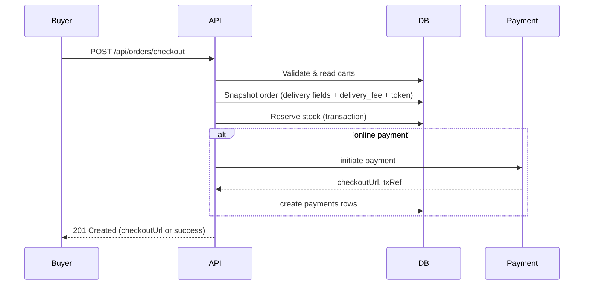
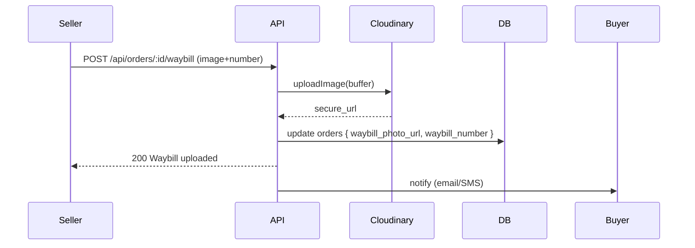
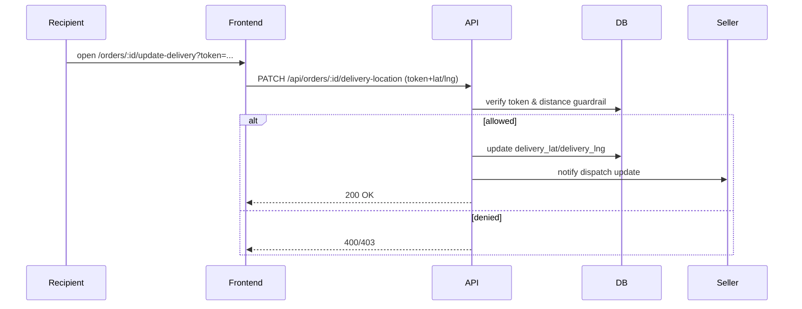

# Sankha — Transaction & Logistics Flow (Detailed)

This document describes the complete end-to-end transaction process implemented in the backend — from checkout through delivery and money release — and details the logistics fork (HOME_DELIVERY vs DEPOT_COLLECTION), pricing computation, snapshotting rules, proof-of-shipment handling, recipient magic-link flows, and notification behavior. It also includes sequence diagrams, API endpoints, sample requests, and operational notes.

---

## Table of Contents
- Overview
- Key Components & Files
- 1) Checkout & Snapshot Flow
  - Validation
  - Snapshot fields
  - Pricing computation
  - Payment initiation
- 2) Logistics Fork: HOME vs DEPOT
- 3) Waybill / Proof of Shipment Flow
- 4) Recipient Magic Link & Location Updates
- 5) Escrow & Release Code Flow
- 6) Notifications (Email / SMS) — content rules
- 7) API Endpoints (summary + sample curl)
- 8) Sequence Diagrams (Mermaid)
- 9) Operational Checklist & Migration Steps
- 10) Edge Cases, Security & Testing

---

## Overview
Sankha implements a logistics-aware checkout and escrow system designed for Malawi: it supports precise local delivery (GPS anchor + landmarks) and inter-city depot collections (waybill + bus receipts). All delivery and pricing details are snapshotted on the `orders` row at checkout so historical orders remain immutable.

Design goals:
- Safety: tokenized recipient updates (magic link) with 20 km guardrails; escrow release only via a 6-digit code.
- Realism: depot workflows, carrier instructions, and package labeling.
- Transparency: delivery fee is a separate line item stored on the order and visible in receipts.


## Key Components & Files
- Prisma DB model: `prisma/schema.prisma` — orders and shops changes (delivery snapshot fields, delivery_fee, seller pricing fields). 
- Checkout orchestration: `src/controllers/order.controller.ts` (checkout, snapshot, delivery token generation, update handlers, waybill upload handler).
- Validation: `src/schemas/order.schema.ts` (checkout schema, delivery updates, uploadWaybillSchema).
- Routes: `src/routes/order.routes.ts` — checkout, delivery-location update, waybill upload, status update, release-code endpoints.
- Email: `src/services/email.service.ts` — buyer receipt, seller dispatch email templates.
- SMS: `src/services/sms.service.ts` — GSM‑7 builders, 160-char enforcement, magic link SMS.
- Cloudinary upload: `src/services/cloudinary.service.ts`.
- Upload middleware: `src/middleware/upload.middleware.ts` (multer in memory storage).


## 1) Checkout & Snapshot Flow

High-level steps (controller `checkout()`):
1. Validate input via `checkoutSchema`.
2. Verify delivery address (if provided) belongs to buyer.
3. Load all carts for buyer (one order per shop).
4. Validate stock.
5. For each cart:
   - Generate order number.
   - Determine `initialStatus` (PENDING_PAYMENT for online, CONFIRMED for COD).
   - Generate `delivery_update_token` (random 16 byte hex).
   - Compute `cartSubtotal`.
   - Resolve seller pricing config: `free_delivery_threshold`, `base_delivery_fee`, `intercity_delivery_fee` from `shops` row.
   - Compute `delivery_fee`:
     - If `cartSubtotal >= free_delivery_threshold` and threshold > 0 ⇒ `delivery_fee = 0`.
     - Else if delivery_method == `HOME_DELIVERY` ⇒ `delivery_fee = base_delivery_fee`.
     - Else if delivery_method == `DEPOT_COLLECTION` ⇒ `delivery_fee = intercity_delivery_fee`.
   - Snapshot immutable fields into `orders` (example):
     - recipient_name, recipient_phone
     - delivery_method
     - delivery_lat / delivery_lng OR depot_lat / depot_lng
     - delivery_directions / preferred_carrier_details
     - package_label_text
     - depot_name / destination_name
     - delivery_fee
     - delivery_update_token
     - release_code (null until generated)
   - Reserve stock via DB transaction.
6. If payment method is online (PayChangu), initiate payment and create `payments` records; otherwise create payment placeholders and generate release code where appropriate.

Important: snapshotting ensures future changes to seller profile do not alter past order records.


## 2) Logistics Fork — HOME_DELIVERY vs DEPOT_COLLECTION

- `delivery_method` enum values: `HOME_DELIVERY`, `DEPOT_COLLECTION`.
- If `HOME_DELIVERY`:
  - Required: `delivery_lat`, `delivery_lng` (GPS anchor).
  - Required driver guide: `delivery_directions` (landmarks).
  - Recipient token allows moving pin (HOME only) within 20 km.
- If `DEPOT_COLLECTION`:
  - Required: `depot_name`, `depot_lat`, `depot_lng`.
  - Save `preferred_carrier_details` and `package_label_text`.
  - Seller must upload waybill (number or photo) before marking shipped; receipts are stored on the order as `waybill_photo_url` and `waybill_number`.


## 3) Waybill / Proof of Shipment Flow

- Endpoint: `POST /api/orders/:orderId/waybill` (protected, shop owner or admin).
- Accepts multipart/form-data with form field `image` (multer `uploadSingle`). Optional body param `waybill_number`.
- Controller uses `CloudinaryService.uploadImage(file.buffer, folder)` and stores the returned `secure_url` into `orders.waybill_photo_url` and waybill_number into `orders.waybill_number`.
- After upload, notify buyer/recipient by email (and SMS optionally). The seller's UI has a CTA (Upload Waybill / Bus Receipt) in the Dispatch Command Center email.
- Seller cannot mark order as `READY_FOR_PICKUP` (or other shipped statuses) without uploading waybill: controller validates presence of `waybill_number` or `waybill_photo_url` when transitioning status for depot shipments.


## 4) Recipient Magic Link & Location Updates

- `delivery_update_token` generated at checkout and saved on order.
- Magic-link format (frontend): `/orders/:orderId/update-delivery?token=...`
- Server `updateDeliveryLocation` accepts either an authenticated buyer OR a valid token.
- Allowed actions by token:
  - HOME_DELIVERY: update `delivery_lat`, `delivery_lng`, `delivery_directions` (max 20 km from original anchor; Haversine check).
  - DEPOT_COLLECTION: view-only (waybill photo and depot map) — no location change.
- Once `order.status === OUT_FOR_DELIVERY`, updates are rejected.
- Notifications: seller receives email + SMS when recipient updates location; recipient receives SMS on gift flows when order created or updated.


## 5) Escrow & Release Code Flow

- Release code is a per-order 6-digit code (stored in `orders.release_code`). Generated by `orderConfirmationService.generateReleaseCode()`.
- Buyer receives the code (email with Gold Action Zone + SMS) and only releases it to the driver after inspection.
- Seller verifies the code via `POST /api/orders/:orderId/verify-release-code` (server-side checks the code and marks funds release).
- Release code status is tracked in `release_code_status` (PENDING, VERIFIED, etc.). The release action triggers wallet crediting to seller and transaction record creation.


## 6) Notifications & Content Rules

- Email (Resend) rules:
  - Buyer receipt: Navy header `#002147`, Gold Action Zone `#FFD700` with monospace 6-digit code, itemized pricing (Subtotal, Delivery, Total), and bold escrow warning.
  - Seller Dispatch: Navy header, Teal CTA `#2EC4B6`, show Navigate button (maps link to GPS anchor or depot), Driver Notes box, Carrier Instructions, `📦 WRITE ON BOX: [Label Text]` prominently, and Fee Note: `Note: Buyer has paid [Fee] for transport costs.`
- SMS (Africa's Talking): all messages are GSM‑7 sanitized and truncated to 160 chars. Different builders for buyer/recipient/seller:
  - Buyer (HOME): "Your driver is coming! View their location hint here: [Link]. Your Release Code: [Code]."
  - Buyer (DEPOT): "Your gift is on the [Carrier] bus! Waybill: #[Number]. Collect at [Depot]. Look for box '[Label]'. Code: [Code]."
  - Recipient magic-link SMS (gift): short link to update or view status.


## 7) API Endpoints (summary)

- `POST /api/orders/checkout` — checkout; body includes `delivery_method`, `delivery_lat/lng` or `depot_name + depot_lat/lng`, `recipient_name`, `recipient_phone`, `package_label_text`, etc.
- `PATCH /api/orders/:orderId/delivery-location` — update delivery pin (buyer or token). Body: `delivery_lat`, `delivery_lng`, `delivery_directions`, `token` (optional).
- `POST /api/orders/:orderId/waybill` — upload waybill photo (multipart `image`) + optional `waybill_number`. Protected (shop owner or admin). Stores `waybill_photo_url` and `waybill_number`.
- `PATCH /api/orders/:orderId/status` — seller updates status. For DEPOT orders, marking `READY_FOR_PICKUP` requires `waybill_number` or `waybill_photo_url`.
- `GET /api/orders/:orderId/release-code` — buyer can retrieve release code (protected).
- `POST /api/orders/:orderId/verify-release-code` — seller verifies code to release funds.

### Sample curl (waybill upload)

```bash
curl -X POST "https://api.example.com/api/orders/<ORDER_ID>/waybill" \
  -H "Authorization: Bearer <SELLER_TOKEN>" \
  -F "image=@/path/to/waybill.jpg" \
  -F "waybill_number=WB-123456"
```

### Sample curl (recipient updates location via token)

```bash
curl -X PATCH "https://api.example.com/api/orders/<ORDER_ID>/delivery-location" \
  -H "Content-Type: application/json" \
  -d '{"delivery_lat": -13.9626, "delivery_lng": 33.7741, "delivery_directions": "Blue gate opposite mosque", "token": "<DELIVERY_TOKEN>"}'
```


## 8) Sequence Diagrams (Mermaid)

Checkout → Order creation (high level):



Waybill upload and ship:



Recipient magic link (HOME):




## 9) Operational Checklist & Migration Steps

1. Apply migrations and generate Prisma client:

```bash
npx prisma migrate dev --name add-logistics-depot-waybill-pricing
npx prisma generate
```

2. Ensure environment variables are present:
- `DATABASE_URL` (Postgres)
- `RESEND_API_KEY`, `RESEND_FROM` (email)
- `AFRICASTALKING_API_KEY`, `AFRICASTALKING_USERNAME`, `AFRICASTALKING_FROM`
- `CLOUDINARY_URL` or Cloudinary individual vars in `src/config/cloudinary.config`.
- `FRONTEND_URL` for magic-link construction.

3. Restart server and run integration tests that exercise:
- Checkout HOME & DEPOT
- Waybill upload flow and seller status transition
- Recipient magic link PIN update (20 km rule)
- Release code generation & verification

4. Observability & logs:
- Email send HTML debug files are stored in `generated/email-debug/` in non-production mode for troubleshooting.


## 10) Edge Cases, Security, and Testing

- Ensure strong input validation on the frontend for `delivery_method` and required fields per path.
- Test token expiry and consider rotating tokens or TTLs if necessary.
- If `free_delivery_threshold` is 0 or missing, behavior falls back to charging the `base_delivery_fee` or `intercity_delivery_fee`.
- Rate limit location updates and magic-link attempts to avoid abuse.
- For waybill photo uploads, consider adding Virus/MIME scanning in your ingestion pipeline.

---

### Appendix: Quick dev checklist (curl-based)
- Checkout (HOME):
  - `POST /api/orders/checkout` with `delivery_method=HOME_DELIVERY`, `delivery_lat`, `delivery_lng`, `package_label_text`.
- Checkout (DEPOT):
  - `POST /api/orders/checkout` with `delivery_method=DEPOT_COLLECTION`, `depot_name`, `depot_lat`, `depot_lng`, `package_label_text`.
- Upload waybill:
  - `POST /api/orders/:id/waybill` (multipart image + waybill_number, seller auth required).
- Recipient update (token):
  - `PATCH /api/orders/:id/delivery-location` with `token` and lat/lng.
- Verify release code (seller):
  - `POST /api/orders/:id/verify-release-code` with code in body.


---

If you'd like, I can now:
- Add more detailed sample JSON request/response bodies for each endpoint, or
- Render and save the Mermaid diagrams as PNG/SVG into `docs/` via the Mermaid renderer and check them into the repo, or
- Generate a short Postman collection (JSON) with the key endpoints for QA.

Which of the three would you like next?